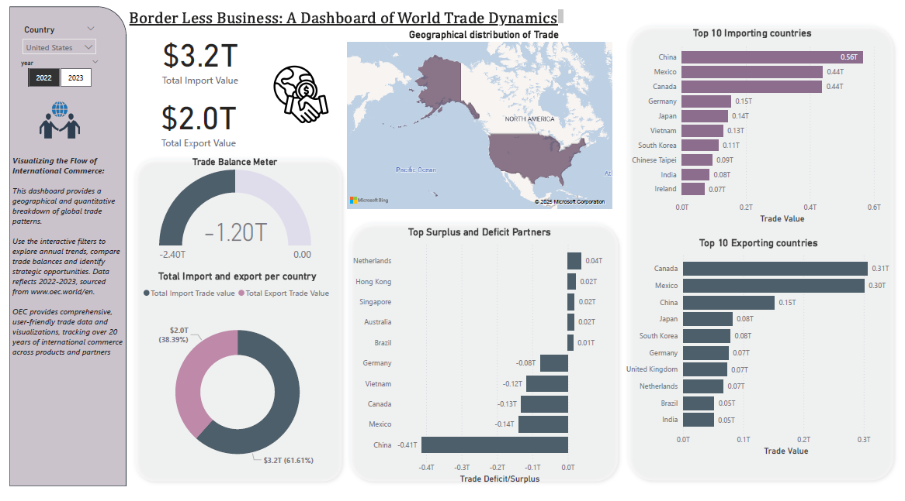
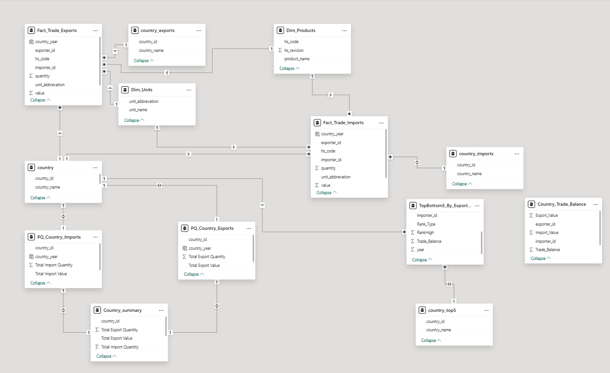

# 🌍 International Trade Analytics Dashboard 📊

Welcome to the **International Trade Dashboard** project!  
This Power BI dashboard provides a comprehensive and interactive visualization of global trade activities between countries, highlighting **top 5 trade surpluses** and **bottom 5 trade deficits** for selected exporting countries.

---

## 🧭 Features

✨ Explore trade balances between countries  
📌 Select an exporter and view their top/bottom trade partners  
📅 Analyze trade flows by year  
🗺️ Map views of imports and exports  
📊 Trend lines, bar charts, and ranking visuals  
🧠 Backed by a dimensional data model

---

## 📷 Snapshots

### 🖼️ Dashboard Preview
> *(Insert screenshot of your dashboard here)*  

### 📐 Dimensional Model (Star Schema)
> *(Insert ERD or star schema image of your model here)*  

---

## 🛠️ Technologies Used

- **Power BI Desktop**
- **DAX** for dynamic measures
- **Power Query** for data transformation
- **Dimensional modeling** (fact & dimension tables)
- **GitHub** for version control and documentation

---

## 🧱 Data Model Highlights

The dashboard is built on a star schema that includes:

- `Fact_Trade_Exports`  
- `Fact_Trade_Imports`  
- `Dim_Country`  
- `Country_Trade_Balance` (merged summary table)  
- DAX-generated table: `TopBottom5_By_Exporter_Year`

🔁 Relationships are established via `exporter_id` and `importer_id` to the `country` dimension.

---

## 📈 Key Measures

- `Trade Balance = Export Value - Import Value`  
- `Filtered_Trade_Balance` – returns values only for Top 5 Surplus & Bottom 5 Deficit per selected exporter  
- `RANKX()` logic applied per `exporter_id` and `year` for dynamic ranking

---

## 🎯 Usage

1. Clone the repository or download the `.pbix` file.
2. Open in **Power BI Desktop**.
3. Use the **slicer** to select an exporting country.
4. Analyze:
   - Top 5 countries in trade surplus
   - Bottom 5 countries in trade deficit
   - Trade trends and patterns over time

---

## 🧠 Learnings & Skills Demonstrated

- Advanced DAX ranking logic with `RANKX`, `EARLIER`, and conditional filtering
- Dynamic measures that respond to slicer input
- Building effective visual narratives using Power BI
- Dimensional modeling and relationship management

---

## 💬 Feedback & Contributions

Feel free to open issues or submit pull requests for improvements.  
Let's build better data stories together! 🚀

---

## 📅 Author

👩‍💻 **Kavya**  
Master's in Business Analytics | Data Enthusiast | Power BI Developer

---

